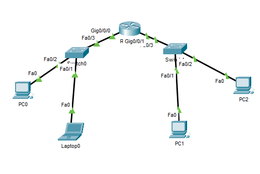

#Lab 1 - Conexão entre duas subredes e rota estática

> Objetivo de criar duas redes /24 diferentes com dois dispositivos conectados por switch.  
Os dispositivos alcançam os vizinhos na rede local e na outra rede.  

- rede 1:
192.168.10.0/24

pc1: 192.168.10.2 255.255.255.0
nt1: 192.167.10.3 255.255.255.0

gateway padrão: 192.168.10.1

- rede 2:
192.168.11.0/24

pc1: 192.168.11.2 255.255.255.0
pc2: 192.168.11.3 255.255.255.0

gateway padrão: 192.168.11.1

- Roteador:
interface gigabitethernet 0/0/0: 192.168.10.0  
interface gigabitethernet 0/0/1: 192.168.11.0 

