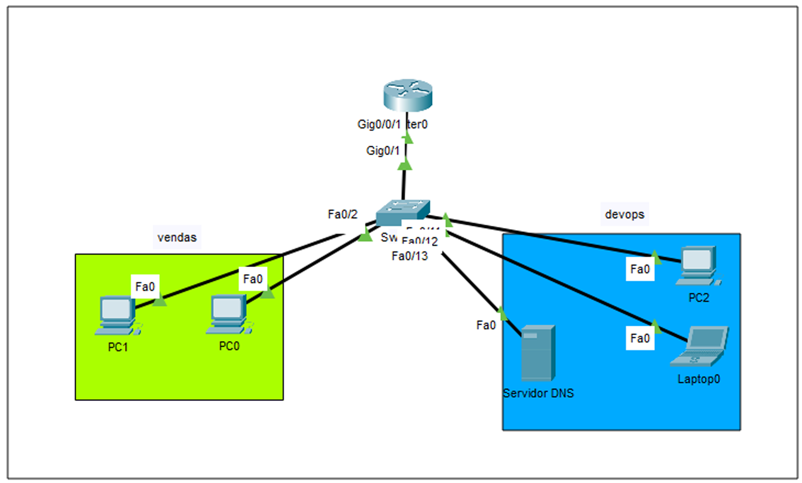
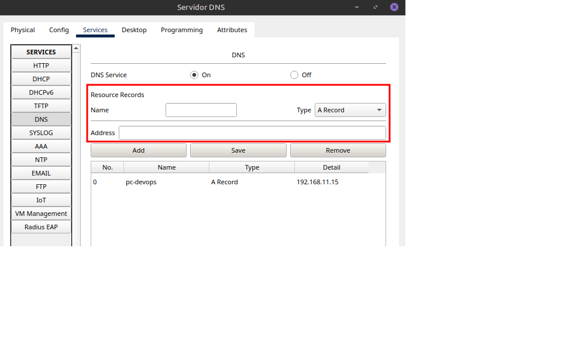

### **Sub-rede 1 (Vendas)**
- **Endereço de Rede:** `192.168.10.0/24`
- **Dispositivos:** `pc0`, `pc1`
- **IPs dos Dispositivos:** `192.168.10.15`, `192.168.10.16`
- **Portas do Switch:** `FastEthernet 0/1`, `0/2`

### **Sub-rede 2 (DevOps)**
- **Endereço de Rede:** `192.168.11.0/24`
- **Dispositivos:** `pc2`, `lpt1`, `DNSS`
- **IPs dos Dispositivos:** `192.168.11.15`, `192.168.11.14`, `192.168.11.13`
- **Portas do Switch:** `FastEthernet 0/11`, `0/12`, `0/13`

---

i

## Configuração do Switch

### 1. Criação das VLANs

Use os seguintes comandos na **CLI (Command Line Interface)** do switch:

```bash
> enable (privilégio de execução)
> configure terminal (configurar dispositivo)
> hostname Switch_vlan (nome que quiser)
> vlan 10 (id da vlan)
> name vendas (nome da vlan com id escolhido)
> vlan 20
> name devops
> end (fim da configuração)
> write memory (salvar configuração)

### Designar portas 
### Voltar para o modo global e usar os comandos:

> enable
> configure terminal
> interface range fa0/1-10 (escolher o range de portas)
> switchport mode access vlan 10 (range de portas vira do tipo 'access' na vlan 10)
> exit (sai da configuração da vlan 10)
> interface range fa0/11-20 (range de portas)
> switchport mode access vlan 20 (tipo access para range de portas da vlan 20)
> end (fim da configuração)
> write memory (salvar configuração)

## Configuração do Roteamento Inter-VLANs  
Neste ponto, os dispositivos estão separados em dois domínios de broadcast. Pings entre dispositivos da mesma VLAN funcionarão, mas entre VLANs diferentes, não. Para resolver isso, configuraremos o roteamento.  

### 1. Configuração da Porta Trunk no Switch
- Conecte o roteador ao switch usando a porta GigabitEthernet 0/1 do switch e do roteador.
> enable
> configure terminal
> interface GigabitEthernet0/1 (selecionar porta)
> switchport mode trunk (definir porta como trunk)
> switchport trunk allowed vlan 10,20 (permitir tráfego dessas das vlans 10 e 20)
> exit (sair, ué)

### 2. Configuração do Roteador (Router-on-a-stick)
- Essa configuração permite a criação de duas sub-interfaces na porta GigabitEthernet0/0/1 do roteador. Uma interface possuirá dois endereços para receber o tráfego das vlans.  
> enable
> show ip interface brief (mostrar interfaces do roteador)
> configure t 
> interface GigabitEthernet0/0/1 (seleciona a interface)
> no shutdown (ativa a interface)
> exit 
> interface GigabitEthernet0/0/1.10 (define a primeira vlan)
> encapsulation dot1Q 10 (define o protocolo dot1Q para marcar quadros ethernet com o vlan id 10)
> ip address 192.168.10.1 255.255.255.0 (define ip e mask para a subinterface)
> exit
> interface GigabitEthernet0/0/1.20
> encapsulation dot1Q 20
> ip address 192.168.11.1 255.255.255.0
> end
> write memory

Após isso, definimos em cada host o default gateway
- Para a rede vendas, é 192.168.10.1
- Para a rede devops, é 192.168.11.1

# Parte 2 (habilitando DNS interno entre as vlans)
- Na vlan devops (id 20), temos um pc, um laptop e um servidor. No servidor, clicamos em serviços e depois habilitamos o DNS (Domain Name Service).  
- Esse servidor fará o papel de servidor DNS interno. Basicamente, ele fará as máquinas reconhecerem umas as outras pelo endereço IP ou por um nome escolhido.  
## Primeiro teste  
Antes de tudo, cada dispositivo nas redes devem ter o campo "DNS Server" preenchido com o IP do servidor DNS. Para testar o serviço, habilite o servidor DNS e adicione uma entrada na tela mostrada na imagem:  

  

- Adicione um nome e o endereço de cada dispositivo.  
Para testar se funcionou, adicione uma entrada para o pc de devops e tente fazer um ping com o laptop utilizando o nome do pc. Exemplo: se o nome do pc for pc-devops, no terminal do laptop utilize ping pc-devops.  
Após a configuração geral, cada máquina enxerga todas as outras por nome e IP.  


  
